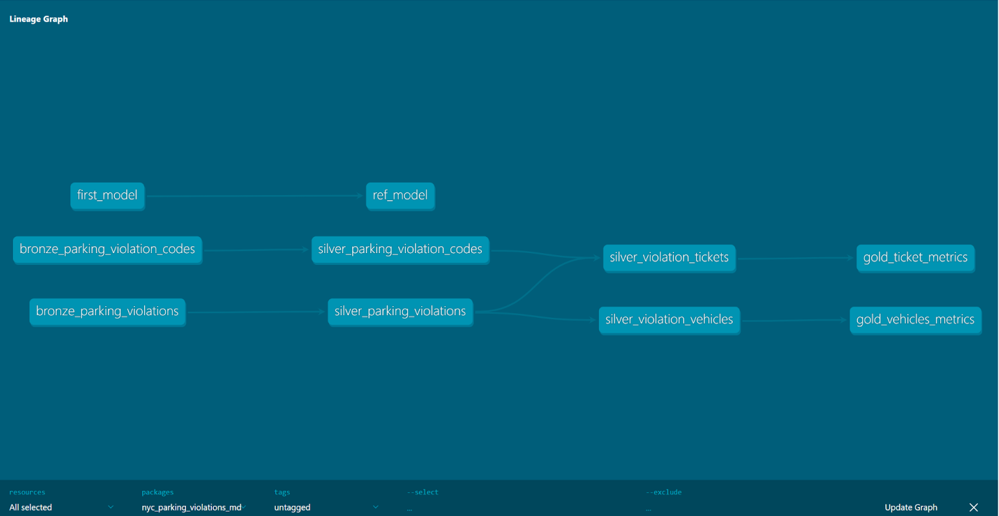

# NYC Parking Violations — dbt case study

A concise case study implementing a dbt pipeline for exploring and transforming NYC parking violations data using DuckDB and dbt. This case study demonstrates how to structure transformations, tests, and documentation using dbt.

## 🔎 Project overview

- **Purpose:** Transform and model NYC parking violations sample data into clean, testable tables and reports using dbt.
- **Main tech:** dbt (dbt-core, dbt-duckdb), DuckDB, Python (for utilities/notebooks).

## 📁 Repository structure (high level)

- `nyc_parking_violations_md/` — main dbt project (models, macros, seeds, tests, docs, target/ artifacts).
- `data/` — raw CSVs used for local exploration and seeding.
- `run_sql_queries.ipynb` — sample Jupyter notebook for running queries against transformed models.
- `env/` — Python virtual environment used for local development.
- `requirements.txt` — Python dependencies for the environment.

##  Prerequisites

- Python 3.10+ (recommended)
- Git (optional)
- dbt (installed via pip in the project venv)

##  Quick setup (Windows)

1. Activate the virtual environment (PowerShell):

```powershell
# PowerShell
.\env\Scripts\Activate.ps1
# or (cmd)
.\env\Scripts\activate.bat
```

2. Install Python dependencies:

```bash
pip install -r requirements.txt
```

3. Ensure `profiles.yml` is configured where dbt expects it (see `nyc_parking_violations_md/profiles.yml`). This project is configured to use DuckDB by default.

##  Common dbt commands

Run seeds (if any):

```bash
dbt --project-dir nyc_parking_violations_md seed
```

Run models:

```bash
dbt --project-dir nyc_parking_violations_md run
```

Run tests:

```bash
dbt --project-dir nyc_parking_violations_md test
```

Generate and serve docs:

```bash
dbt --project-dir nyc_parking_violations_md docs generate
# then
dbt --project-dir nyc_parking_violations_md docs serve
```

##  Notebooks & local exploration

Open `run_sql_queries.ipynb` with Jupyter or VS Code to run SQL queries directly against DuckDB and the dbt artifacts.

## 📌 Notes

- Artifacts and run results are stored under `nyc_parking_violations_md/target/` (catalog, manifest, run_results, compiled SQL, etc.).
- Seed and sample CSV files are in `data/` (and `nyc_parking_violations_md/seeds/` if you add them there).

## 🧾 Medallion Architecture

This project implements a simple **medallion (Bronze → Silver → Gold) architecture** using dbt. The goal is to show how raw data is progressively refined and organized to support analytics and reporting.

### Architecture layers

- **Bronze (raw ingestion)** — Single-step extracts of raw CSVs or source tables, minimal transformation, e.g. `bronze/bronze_parking_violations.sql`, `bronze/bronze_parking_violation_codes.sql`.
- **Silver (cleaned & enriched)** — Cleans and enriches raw data, applies joins and domain logic, e.g. `silver/silver_parking_violations.sql`, `silver/silver_parking_violation_codes.sql`, `silver/silver_violation_tickets.sql`, `silver/silver_violation_vehicles.sql`.
- **Gold (aggregated & served)** — Business-facing aggregates and metrics used for reporting, e.g. `gold/gold_ticket_metrics.sql`, `gold/gold_vehicles_metrics.sql`.

### How it flows (quick walkthrough)

1. Raw CSVs are seeded / read into bronze models (one-to-one mapping from source fields).
2. Silver models apply cleaning logic and domain transformations (e.g., derive `is_manhattan_96th_st_below`, pivot fee columns into `fee_usd`).
3. Gold models build aggregates and metrics used in dashboards or downstream analysis (tickets revenue by `violation_code`, non-NY vehicle counts by state).

### Lineage graph

The repository includes a visual lineage graph showing model relationships and flow between medallion layers.



> Tip: Run `dbt docs generate` then `dbt docs serve` to see an interactive lineage graph and inspect model descriptions.

### What this project demonstrates

- Clear separation of concerns across layers for maintainability and testing
- Easy traceability and impact analysis using dbt's lineage and docs
- A path to scale: keep bronze immutable, version silver transformations, and expose gold as curated outputs

## 📄 License

This project is licensed under the MIT License — see `LICENSE` for details.

For questions, message the repo owner.

